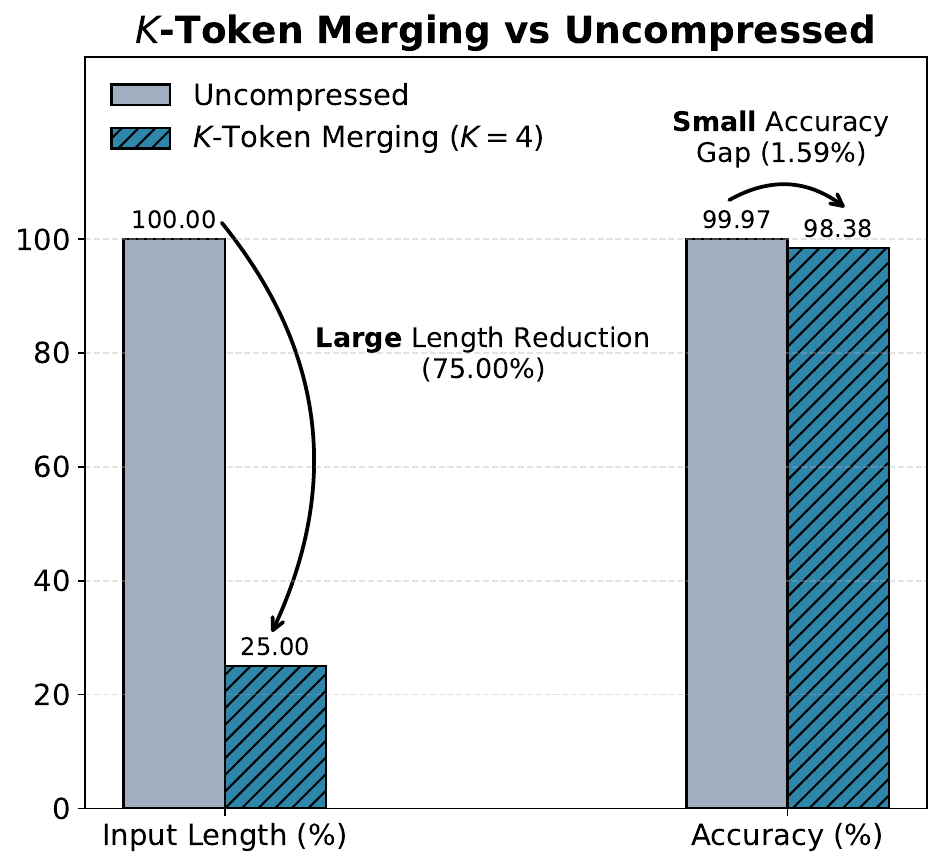
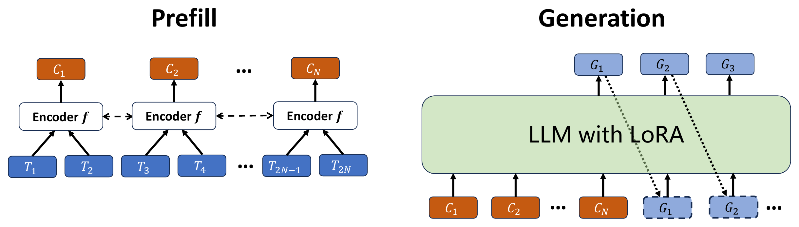

# K-Token Merging

This repo contains the code for our paper:<br>
**Compressing Sequences in the Latent Embedding Space: $K$-Token Merging for Large Language Models**<br>
Zihao Xu, JOhn Harvill, Ziwei Fan, Yizhou Sun, Hao Ding, Hao Wang<br>
[[Paper](https://arxiv.org/abs/2302.02561)]

$K$-Token Merging is a latent-space prompt compression method for large language models. Instead of feeding every input token embedding into the model, it groups each contiguous block of $K$ tokens, merges that block into one learned latent embedding, and lets the language model read the compressed prefix during prefill. Generation still happens in the original token space.

This repository contains the code for training and evaluating that method on three benchmarks:

- Textualized Tree
- Amazon Reviews
- CommitPackFT

On one representative benchmark (Textualized Tree), our $K$-Token Merging method ($K = 4$) achieves a $75\\%$ reduction in input length with only a $1.59\\%$ drop in accuracy, demonstrating that it exploits redundancy in the latent embedding space while preserving high performance. See our [paper](https://arxiv.org/abs/2302.02561) for more results.

<p align="center">
  
</p>

## Model Structure

We describe the model's workflow in two stages: the **prefill** stage and the **generation** stage. During the prefill stage, the encoder $f$ takes each $K$ consecutive input tokens and produces a single compressed token embedding. For the generation stage, the LLM outputs *original* (uncompressed) tokens. Each newly generated token is appended to the mixed compressed/uncompressed prefix, after which standard auto-regressive generation continues.



## How It Works

At a high level, the training and inference flow is:

1. Tokenize the input prompt.
2. Look up base-model token embeddings from a cached embedding table.
3. Split the prompt embeddings into contiguous blocks of size `K`.
4. Merge each block with a lightweight encoder that is initialized to behave like mean pooling and then trained jointly with LoRA adapters.
5. Feed the compressed prefix into the base LLM.
6. Train or evaluate on the original downstream task.

The key idea is that prefill cost depends on the number of embeddings consumed by the model. Compressing the prompt before prefill reduces that length while keeping the rest of the generation pipeline unchanged. With merge factor `K`, the compressed prompt length is approximately `1/K` of the original prompt length, up to padding to a multiple of `K`.

## Repository Layout

This section lists the source-controlled project structure only. Generated folders such as `data/`, `artifacts/`, and `outputs/` are intentionally omitted.

```text
K-Token-Merging/
├── assets/figures/                  # README and paper figures
├── paper/                           # manuscript and figure sources
├── scripts/
│   ├── amazon_reviews/run.py        # Amazon Reviews training/eval entry point
│   ├── commitpackft/run.py          # CommitPackFT training/eval entry point
│   ├── textualized_tree/
│   │   ├── generate_data.py         # generate one tree dataset
│   │   ├── generate_curriculum_datasets.py
│   │   └── run.py                   # tree benchmark training/eval entry point
│   └── utils/extract_embeddings.py  # export base-model embedding table
└── src/k_token_merging/
    ├── compression.py               # prompt compression utilities
    ├── data.py                      # dataset wrappers
    ├── encoder.py                   # average-initialized merge encoder
    ├── metrics.py                   # evaluation metrics
    └── modeling.py                  # model, LoRA, checkpoint helpers
```

## Installation

From the repository root:

```bash
pip install -e .
```

or

```bash
pip install -r requirements.txt
```

The project targets Python `>=3.10`.

## Before You Train

You need:

- a base causal LM, defaulting to `Qwen/Qwen2.5-0.5B`
- an exported embedding table for that base model
- access to the benchmark data
  - Textualized Tree is generated locally
  - Amazon Reviews and CommitPackFT are downloaded from Hugging Face on first use

### 1. Export the Embedding Table

The training scripts expect a pickled embedding table containing one vector per token id:

```bash
python scripts/utils/extract_embeddings.py \
  --model-name Qwen/Qwen2.5-0.5B \
  --output-file artifacts/qwen2.5_0.5b_embeddings_id_full.pkl
```

Useful options:

- `--dtype {float16,bfloat16,float32}` controls the export precision

### 2. Choose a Launch Mode

Each benchmark runner uses `torch.multiprocessing.spawn` internally.

- For multi-GPU training, pass `--gpu-ids 0 1 2 3` or another GPU list.
- For a single-device run, omit `--gpu-ids` and use the default `--device`.

## Quick Start

If you want the shortest path from clone to first run:

```bash
pip install -e .

python scripts/utils/extract_embeddings.py \
  --model-name Qwen/Qwen2.5-0.5B \
  --output-file artifacts/qwen2.5_0.5b_embeddings_id_full.pkl

python scripts/textualized_tree/generate_curriculum_datasets.py \
  --output-root data \
  --write-summary

python scripts/textualized_tree/run.py train \
  --tree-data-root data \
  --embedding-file artifacts/qwen2.5_0.5b_embeddings_id_full.pkl \
  --gpu-ids 0 1 2 3 \
  --merge-factor 4 \
  --output-dir outputs/textualized_tree
```

That run trains stage by stage across the default tree curriculum and evaluates each stage after training.

## Benchmarks

### Textualized Tree

This benchmark turns tree-structured data into text and asks parent/child relationship questions. The repository includes both dataset generation and training code.

Generate one dataset manually:

```bash
python scripts/textualized_tree/generate_data.py \
  --max-depth 4 \
  --max-nodes 30 \
  --min-children 1 \
  --max-children 3 \
  --num-trees 500000 \
  --save-dir data/tree_data_large \
  --stage-name large
```

Generate the full curriculum:

```bash
python scripts/textualized_tree/generate_curriculum_datasets.py \
  --output-root data \
  --stages small xsmall medium xmedium large x3large \
  --num-trees 500000 \
  --write-summary
```

This produces directories like:

```text
data/
├── curriculum_summary.json
├── tree_data_small/
├── tree_data_xsmall/
├── tree_data_medium/
├── tree_data_xmedium/
├── tree_data_large/
└── tree_data_x3large/
```

Each `tree_data_<stage>/` folder contains:

- `tree_*.json`
- `train_file_<stage>.csv`
- `test_file_<stage>.csv`

Built-in stage settings:

| Stage     | Max Depth | Max Nodes | Min Children | Max Children |
| --------- | --------: | --------: | -----------: | -----------: |
| `small`   |         2 |         3 |            0 |            2 |
| `xsmall`  |         3 |         5 |            0 |            2 |
| `medium`  |         3 |        10 |            0 |            3 |
| `xmedium` |         4 |        15 |            1 |            3 |
| `large`   |         4 |        30 |            1 |            3 |
| `x3large` |         4 |       150 |            3 |            5 |

Train across the curriculum:

```bash
python scripts/textualized_tree/run.py train \
  --tree-data-root data \
  --stages small xsmall medium xmedium large x3large \
  --embedding-file artifacts/qwen2.5_0.5b_embeddings_id_full.pkl \
  --gpu-ids 0 1 2 3 \
  --merge-factor 4 \
  --grad-accum-steps 4 \
  --output-dir outputs/textualized_tree
```

If you do not pass `--per-gpu-batch-size`, the runner uses the original Token Compression per-stage defaults:

| Stage     | Per-GPU Train Batch (`merge_factor=2/3`) | Per-GPU Train Batch (`merge_factor=4`) | Per-GPU Eval Batch |
| --------- | ---------------------------------------: | -------------------------------------: | -----------------: |
| `small`   |                                      282 |                                    320 |                320 |
| `xsmall`  |                                      192 |                                    320 |                320 |
| `medium`  |                                      144 |                                    192 |                224 |
| `xmedium` |                                       96 |                                    128 |                192 |
| `large`   |                                       48 |                                     48 |                128 |
| `x3large` |                                       16 |                                     16 |                 32 |

You can override those defaults with `--per-gpu-batch-size` and `--per-gpu-eval-batch-size`.

The real training batch size is:

```text
effective_batch_size = per_gpu_batch_size * num_gpus * grad_accum_steps
```

For example, `per_gpu_batch_size=48`, `num_gpus=4`, and `grad_accum_steps=4` gives an effective batch size of `768`.

We have the following training recipe:

- a stage advances only after reaching at least `85%` accuracy
- the final `x3large` stage only finishes after reaching at least `95%` accuracy

Evaluate one saved stage:

```bash
python scripts/textualized_tree/run.py evaluate \
  --tree-data-root data \
  --stage x3large \
  --embedding-file artifacts/qwen2.5_0.5b_embeddings_id_full.pkl \
  --merge-factor 4 \
  --checkpoint-dir outputs/textualized_tree/x3large/step_last
```

Evaluation writes `eval_accuracy.json` into the checkpoint directory.

### Amazon Reviews

This benchmark treats review sentiment as a text classification problem using next-token prediction over label words.

Train:

```bash
python scripts/amazon_reviews/run.py train \
  --dataset-name Amazon_Fashion \
  --embedding-file artifacts/qwen2.5_0.5b_embeddings_id_full.pkl \
  --gpu-ids 0 1 2 3 \
  --merge-factor 4 \
  --grad-accum-steps 4 \
  --output-dir outputs/amazon_reviews
```

Evaluate:

```bash
python scripts/amazon_reviews/run.py evaluate \
  --dataset-name Amazon_Fashion \
  --embedding-file artifacts/qwen2.5_0.5b_embeddings_id_full.pkl \
  --merge-factor 4 \
  --checkpoint-dir outputs/amazon_reviews/Amazon_Fashion/step_last
```

Evaluation writes `eval_accuracy.json` into the checkpoint directory.

Useful task-specific options:

- `--test-size` controls the held-out split size
- `--train-sample-fraction` subsamples the training portion for faster runs

### CommitPackFT

This benchmark uses commit editing data and evaluates the model as a code-generation system. The default language is `python`.

Train:

```bash
python scripts/commitpackft/run.py train \
  --language python \
  --embedding-file artifacts/qwen2.5_0.5b_embeddings_id_full.pkl \
  --gpu-ids 0 1 2 3 \
  --merge-factor 2 \
  --grad-accum-steps 4 \
  --output-dir outputs/commitpackft
```

Evaluate:

```bash
python scripts/commitpackft/run.py evaluate \
  --language python \
  --embedding-file artifacts/qwen2.5_0.5b_embeddings_id_full.pkl \
  --merge-factor 2 \
  --checkpoint-dir outputs/commitpackft/python/step_last
```

Evaluation writes `eval_perplexity.json` into the checkpoint directory.

## Checkpoints and Outputs

Each training run saves a `step_last/` directory that contains:

- LoRA adapter weights saved by PEFT
- `encoder.pth` for the K-token merge encoder
- `optimizer.pt` when training checkpoints are saved
- `metrics.json` with run metadata
- evaluation output such as `eval_accuracy.json` or `eval_perplexity.json`

Typical output layout:

```text
outputs/
└── <benchmark>/
    └── <stage-or-subset>/
        └── step_last/
            ├── adapter_config.json
            ├── adapter_model.*
            ├── encoder.pth
            ├── metrics.json
            ├── optimizer.pt
            └── eval_*.json
```

## Main Configuration Knobs

The most important command-line options across benchmarks are:

- `--model-name`: base causal LM
- `--embedding-file`: pickled token embedding table
- `--merge-factor`: the $K$ in $K$-Token Merging; it controls how many prompt tokens are compressed into one latent embedding
- `--embedding-dim`: embedding size expected by the base model
- `--gpu-ids`: devices used by the spawned workers
- `--per-gpu-batch-size`: training batch size on each GPU/process
- `--per-gpu-eval-batch-size`: evaluation batch size on each GPU/process
- `--grad-accum-steps`: gradient accumulation factor during training
- `--output-dir`: where checkpoints and metrics are written
- `--resume-peft`, `--resume-encoder`, `--resume-optimizer`: resume training from saved artifacts

## Codebase Map

If you want to modify the method itself, these are the main files to start with:

- `src/k_token_merging/encoder.py`: merge encoder architecture
- `src/k_token_merging/compression.py`: how prompt embeddings are grouped and compressed
- `src/k_token_merging/modeling.py`: LoRA setup, model loading, checkpoint saving
- `scripts/*/run.py`: benchmark-specific training and evaluation loops

## Reference

[Compressing Sequences in the Latent Embedding Space: $ K $-Token Merging for Large Language Models](https://arxiv.org/abs/2604.15153)

```bib
@article{xu2026compressing,
  title={Compressing Sequences in the Latent Embedding Space: $ K $-Token Merging for Large Language Models},
  author={Xu, Zihao and Harvill, John and Fan, Ziwei and Sun, Yizhou and Ding, Hao and Wang, Hao},
  journal={arXiv preprint arXiv:2604.15153},
  year={2026}
}
```

